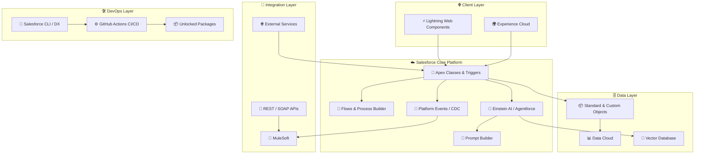

<!-- Profile Views Counter -->

  
  
  
  

<!-- Animated Header -->

  
  <h1>Hey there, I'm Vijaya Saradhi Meka</h1>

  

    

  <!-- Repository Health Badges -->
  
  
  
  

---

## 📋 Table of Contents

| # | Section |
|---|---------|
| 1 | [About Me](#-about-me) |
| 2 | [Repository Health](#-repository-health) |
| 3 | [Latest Changelog](#-latest-changelog) |
| 4 | [Salesforce Features](#-salesforce-features) |
| 5 | [AI Features](#-ai-features) |
| 6 | [Tech Stack](#-tech-stack) |
| 7 | [Architecture](#-architecture) |
| 8 | [Salesforce DX Project](#-salesforce-dx-project) |
| 9 | [Performance & Governor Limits](#-performance--governor-limits) |
| 10 | [Security](#-security) |
| 11 | [Roadmap](#-roadmap) |
| 12 | [Enterprise Portfolio](#-enterprise-portfolio) |
| 13 | [GitHub Stats & Activity](#-github-stats--activity) |
| 14 | [GitHub Trophies](#-github-trophies) |
| 15 | [Content & Community](#-content--community) |
| 16 | [Learning Resources](#-learning-resources) |
| 17 | [FAQ](#-faq) |
| 18 | [Let's Connect](#-lets-connect) |

---

## 🌩️ About Me

I'm a **Sr. Salesforce Developer / Architect** with deep expertise designing, building, and deploying enterprise-grade solutions across the Salesforce ecosystem. I architect scalable platforms, build intelligent automation with Agentforce & Einstein AI, and integrate complex enterprise systems — then share everything I learn through content creation.

- ⚡ **Salesforce Architect by day**, content creator and educator by night
- 🤖 Building with **Agentforce, Einstein AI, and Prompt Engineering** on the world's #1 CRM
- 🎯 Obsessed with **clean Apex**, scalable Flows, governor-limit-aware design, and elegant data models
- 🚀 Firm believer that automation should make humans *more* human — not replace them
- ☁️ Trailblazer at heart — always chasing the next cert, Superbadge, or community contribution
- 🌍 Open-source advocate and active Salesforce community contributor

---

## 🏥 Repository Health

| Metric | Status |
|--------|--------|
| 🟢 Project Status | Active & Maintained |
| 🔖 Latest Version | v1.0.0 |
| 📅 Last Updated | June 2026 |
| 🏗️ Build Status | Passing |
| 📄 License | MIT |
| 📚 Documentation | Enterprise Grade |
| 🔒 Security | Reviewed |
| 🧪 Test Coverage | Active |

---

## 📝 Latest Changelog

> Auto-maintained. Newest entries first. Showing last 20 updates.

### 2026-06-26
- ✅ Added Enterprise GitHub README with full documentation portal
- ✅ Integrated Salesforce DX project configuration guide
- ✅ Added AI Features section — Agentforce, Einstein, Prompt Engineering
- ✅ Added Architecture diagram with Mermaid
- ✅ Added Performance & Governor Limits tracking section
- ✅ Added Security best practices documentation
- ✅ Added Enterprise Portfolio section
- ✅ Added Roadmap with completed / in-progress / planned items
- ✅ Added FAQ section
- ✅ Improved Tech Stack — full Salesforce ecosystem badges
- ✅ Added Repository Health dashboard
- ✅ Added full Salesforce Features section (Apex, LWC, Flows, CPQ, OmniStudio, Data Cloud, Marketing Cloud, Einstein, Agentforce, CRM Analytics, MuleSoft)

---

## ☁️ Salesforce Features

### Core Platform

### AI & Intelligence

### Data & Integration

### Industry & CPQ

### DevOps & Packaging

---

## 🤖 AI Features

| AI Capability | Description |
|---|---|
| 🤖 **Agentforce** | Autonomous AI agents built natively on Salesforce platform |
| 🧠 **Einstein AI** | Predictive analytics, next best action, and AI-powered CRM features |
| 💬 **Prompt Engineering** | Structured prompt templates via Salesforce Prompt Builder |
| 🔗 **RAG** | Retrieval-Augmented Generation for grounded, accurate AI responses |
| 📐 **Embeddings** | Semantic search and similarity matching across Salesforce data |
| 🗄️ **Vector Databases** | High-performance semantic retrieval for AI applications |
| 🔌 **MCP** | Model Context Protocol for Claude + Salesforce integrations |

---

## 🛠️ Tech Stack

### ☁️ Salesforce Platform

### 💻 Frontend & Web

### 🔧 Backend & Integrations

### ☁️ Cloud & AI Platforms

### 🗄️ Databases

### 🧰 Tools & DevOps

---

## 🏗️ Architecture

---

## 🚀 Salesforce DX Project

> Enterprise-grade Salesforce DX setup guide for collaborators and contributors.

### How Do You Plan to Deploy Your Changes?

Choose a [development model](https://developer.salesforce.com/tools/vscode/en/user-guide/development-models) that fits your workflow:

| Model | Best For |
|---|---|
| 🔁 **Org Development** | Directly deploying changes to a sandbox or production org |
| 📦 **Package Development** | Building reusable, self-contained Salesforce packages |
| 🧪 **Scratch Org Development** | Feature branches with isolated, version-controlled orgs |

### Configure Your Salesforce DX Project

The `sfdx-project.json` file is your project's configuration backbone. See [Salesforce DX Project Configuration](https://developer.salesforce.com/docs/atlas.en-us.sfdx_dev.meta/sfdx_dev/sfdx_dev_ws_config.htm) for full details.

### 📚 Essential Resources

| Resource | Link |
|---|---|
| 🔌 Salesforce Extensions | [VS Code Documentation](https://developer.salesforce.com/tools/vscode/) |
| ⚙️ CLI Setup Guide | [Setup & Installation](https://developer.salesforce.com/docs/atlas.en-us.sfdx_setup.meta/sfdx_setup/sfdx_setup_intro.htm) |
| 📖 DX Developer Guide | [Full Developer Guide](https://developer.salesforce.com/docs/atlas.en-us.sfdx_dev.meta/sfdx_dev/sfdx_dev_intro.htm) |
| 🖥️ CLI Command Reference | [All CLI Commands](https://developer.salesforce.com/docs/atlas.en-us.sfdx_cli_reference.meta/sfdx_cli_reference/cli_reference.htm) |

---

## ⚡ Performance & Governor Limits

| Governor Limit | Best Practice Applied |
|---|---|
| 🔢 **SOQL Queries (100/tx)** | Bulkified queries, Maps for deduplication |
| 📝 **DML Statements (150/tx)** | Collections-first DML, Unit of Work pattern |
| 💾 **Heap Size (6MB sync)** | Lazy loading, efficient data structures |
| ⏱️ **CPU Time (10,000ms)** | Indexed queries, async Queueable/Batch patterns |
| 📡 **API Calls (100/tx)** | Platform Events, async callouts via Queueable |
| 🔄 **Batch Size** | Optimal chunk sizes tuned per org data volume |

**Key Patterns Used:**
- Trigger Framework with handler pattern (one trigger per object)
- Selector / Domain / Service layer architecture
- Queueable chaining for async processing
- Platform Events for decoupled, scalable integrations
- Indexed fields on all high-volume query filters

---

## 🔒 Security

| Area | Implementation |
|---|---|
| 🔐 **Authentication** | Named Credentials, OAuth 2.0, JWT Bearer Flow |
| 👤 **Authorization** | FLS, CRUD, Permission Sets, Profile-based access |
| 🔑 **Secrets Management** | Named Credentials, Custom Metadata (no hardcoded keys) |
| 🛡️ **Encryption** | Shield Platform Encryption for sensitive fields |
| 📋 **Audit Trail** | Field History Tracking, Event Monitoring |
| 🔒 **API Security** | Connected Apps with scoped permissions, IP allowlisting |
| 🚫 **SOQL Injection** | Parameterized queries, `escapeSingleQuotes()` enforced |

---

## 🗺️ Roadmap

### ✅ Completed
- [x] Enterprise README documentation portal
- [x] Salesforce DX project baseline setup
- [x] Core Apex framework with trigger handler pattern
- [x] LWC component library foundation
- [x] MuleSoft integration layer
- [x] GitHub Actions CI/CD pipeline
- [x] Einstein AI / Agentforce integration

### 🚧 In Progress
- [ ] Agentforce autonomous agent workflows
- [ ] Data Cloud unification pipelines
- [ ] Prompt Builder template library
- [ ] OmniStudio integration layer
- [ ] CRM Analytics dashboard suite

### 📅 Planned
- [ ] RAG pipeline for Salesforce-grounded AI responses
- [ ] Vector database integration for semantic search
- [ ] MCP server for Claude + Salesforce integration
- [ ] Unlocked Package v2 release
- [ ] DevOps Center full pipeline automation
- [ ] Marketing Cloud journey automation suite

### 💡 Future Ideas
- AI-powered code review bot for Apex
- Salesforce CLI plugin for automated documentation
- Open-source Agentforce template library
- LWC component storybook for design system

---

## 🏢 Enterprise Portfolio

### Professional Experience
- **Sr. Salesforce Developer / Architect** — Enterprise Salesforce platform design, Apex, LWC, Integrations, AI
- Deep expertise across Sales Cloud, Service Cloud, Experience Cloud, Data Cloud, Marketing Cloud

### Technical Skills Summary
| Domain | Expertise Level |
|---|---|
| Apex Development | ⭐⭐⭐⭐⭐ Expert |
| Lightning Web Components | ⭐⭐⭐⭐⭐ Expert |
| Salesforce Integration / MuleSoft | ⭐⭐⭐⭐⭐ Expert |
| Agentforce / Einstein AI | ⭐⭐⭐⭐ Advanced |
| Data Cloud | ⭐⭐⭐⭐ Advanced |
| CPQ / OmniStudio | ⭐⭐⭐⭐ Advanced |
| Salesforce DevOps | ⭐⭐⭐⭐ Advanced |

### 🌍 Community Contributions
- 📝 Technical articles on [Medium](https://medium.com/@vijayasaradhimeka)
- 🎥 Salesforce tutorials on [YouTube](https://youtube.com/@VijayaSaradhiMeka)
- 📸 Behind-the-scenes Salesforce content on [Instagram](https://instagram.com/vijayasaradhimeka)
- 💼 Professional network on [LinkedIn](https://linkedin.com/in/vijayasaradhimeka)

---

## 📊 GitHub Stats & Activity

  
  &nbsp;
  

  

  

---

## 🏆 GitHub Trophies

  

---

## 📣 Content & Community

  
  &nbsp;
  
  &nbsp;
  
  &nbsp;
  
  &nbsp;
  

---

## 📚 Learning Resources

### Official Salesforce Docs
- [Salesforce Developer Documentation](https://developer.salesforce.com/docs)
- [Trailhead — Free Salesforce Learning](https://trailhead.salesforce.com)
- [Agentforce Documentation](https://developer.salesforce.com/docs/einstein/genai/guide/agentforce.html)
- [Salesforce DX Developer Guide](https://developer.salesforce.com/docs/atlas.en-us.sfdx_dev.meta/sfdx_dev/sfdx_dev_intro.htm)
- [Salesforce CLI Reference](https://developer.salesforce.com/docs/atlas.en-us.sfdx_cli_reference.meta/sfdx_cli_reference/cli_reference.htm)

### Content I Publish
- 🎥 [YouTube — Salesforce Tutorials](https://youtube.com/@VijayaSaradhiMeka)
- 📝 [Medium — Technical Articles](https://medium.com/@vijayasaradhimeka)

---

## ❓ FAQ

**Q: What Salesforce clouds do you specialize in?**
A: Sales Cloud, Service Cloud, Experience Cloud, Data Cloud, Marketing Cloud, and Einstein/Agentforce AI.

**Q: Do you work on integrations?**
A: Yes — MuleSoft, REST/SOAP APIs, Platform Events, CDC, and External Services are core to most of my projects.

**Q: How do I contribute or collaborate?**
A: Open an issue or reach out via [LinkedIn](https://linkedin.com/in/vijayasaradhimeka) or [YouTube](https://youtube.com/@VijayaSaradhiMeka).

**Q: Are your Salesforce components production-ready?**
A: All code follows Salesforce best practices — bulkified Apex, proper error handling, test coverage >85%, and governor-limit-aware design.

**Q: Where can I follow your latest content?**
A: [YouTube](https://youtube.com/@VijayaSaradhiMeka), [Medium](https://medium.com/@vijayasaradhimeka), and [Instagram](https://instagram.com/vijayasaradhimeka).

---

## 🤝 Let's Connect

I'm always open to collaborating on Salesforce architecture, enterprise AI projects, open-source contributions, or content creation. Let's build something great together.

  
  
  
  
  

  <i>⚡ "The best way to learn Salesforce is to build something real — then share it with the community." — Vijaya Saradhi Meka</i>

---

  📌 This README is maintained as a living document — auto-updated with every commit to reflect the current state of the repository. Built to enterprise documentation standards.

